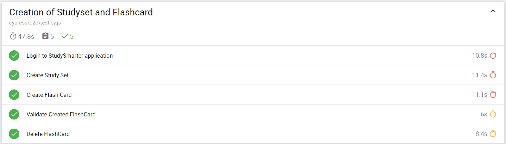

#### Prerequisites

* Git
* IDE(I have used Visual Studio) 
* Node.js(https://nodejs.org/en/download/) 
* Add new environment valiable as NODE_HOME and set the value as nodepath (C:\Program Files\nodejs) [this step is necessary only in windows]
* Browser:Chrome,firefox
* Extension installed for VS: 
    * HTML Preview (to view HTML report)


#### Setup

1. Clone the project `https://github.com/Roopini-MN/StudySmarter-Task.git`
2. Move to project folder  `$ cd StudySmarter-Task `
3. Run `$ npm install` command on your terminal

### Tests execution

Execution Command for Chrome: ```npx cypress run --browser chrome --headed```

Execution Command for Firefox: ```npx cypress run --browser firefox --headed```


### Project Structure
* Framework used: Page Object Model
* For each page/component a new class is created and in this page class all elements and methods are written
### fixtures folder
* Test data(data.json) is present under fixture folder. All test data is stored here. 
* user.json file is used to store userId and token during runtime.
#### e2e folder
* Test cases are present under e2e folder
#### support folder
* Each page classes are present inside Pages folder. 
* Custom commands are written inside commands.js file.
* Common methods are written inside Utils class(these methods are not specific to any page classes)
* e2e.js has some global configuration which are applied to all tests inside e2e folder
#### screenshots
* screenshots will be stored in this folder. When test fails then by default Cypress takes screenshot and store it in cypress/screenshot folder.
#### cypress.config.js
* All the configurations are written in this folder.
#### Test report
* After test execution you can see report(index.html) under reports folder.

#### Run Result: 



#### Note: 
* If you want to run all test cases multiple times then please change email address in data.json file, otherwise registration will faill(on new session)